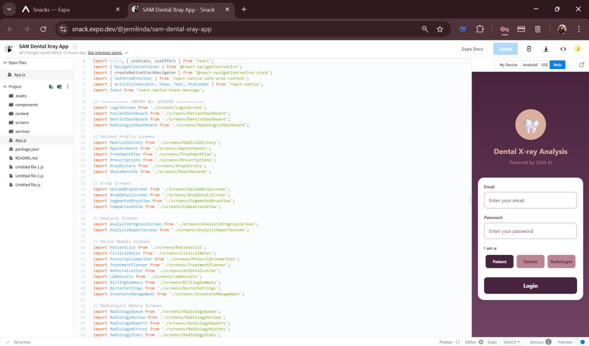
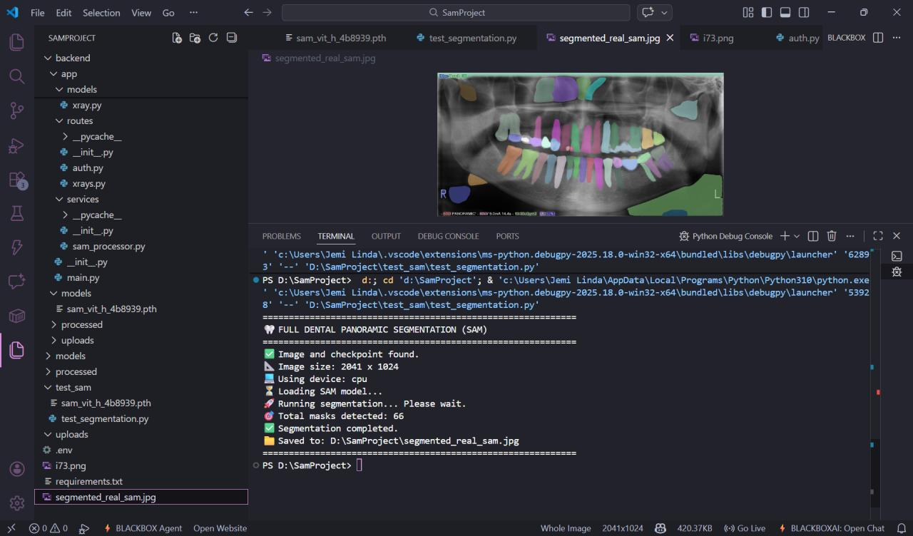
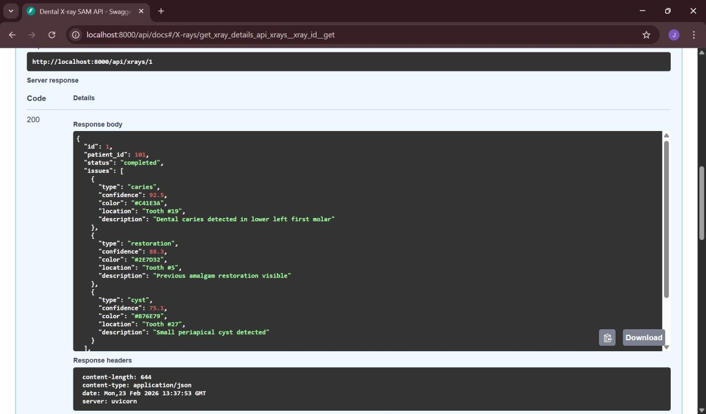

# AI-Based-Dental-Image-Segmentation-using-Segment-Anything-Model-SAM-
A proof-of-concept system for automated dental X-ray segmentation using a pre-trained Segment Anything Model (SAM), demonstrating AI-assisted medical image analysis.

## 🧩 Project Overview

- Developed a prototype dental imaging system using Segment Anything Model (SAM) for automated segmentation of dental X-ray images  

- Applied zero-shot learning to identify and segment teeth, dental caries, interproximal gaps, periapical regions, and root structures  

- Designed a full-stack architecture with React Native - Expo (frontend), Python (backend), and MySQL (database) for handling image processing workflows  

- Implemented image preprocessing and segmentation pipeline to generate pixel-level masks for radiographic analysis  

- Visualized segmentation results by overlaying masks on original X-ray images to highlight regions of interest  

- Utilized computer vision and deep learning techniques without requiring custom model training or annotated datasets  

- Built as a proof-of-concept system to demonstrate AI-assisted analysis and decision support in dental imaging

## 🛠 Tech Stack
- Frontend: React Native (Expo)
- Backend: Python
- AI Model: Segment Anything Model (SAM)
- Database: MySQL
- Domain: Medical Imaging / Computer Vision

## 📊 Demo / Output

The system generates pixel-level segmentation masks and overlays them on dental X-ray images for visual interpretation.

### Sample Results

## 🏗 System Architecture

React Native (UI) → Python (SAM-based Image Processing Backend) → MySQL (Result Storage)

## 📌 Note
This is a proof-of-concept project and not deployed in production.
